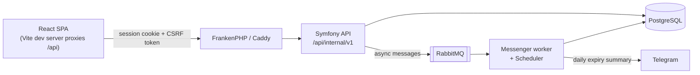

# Hestia

A self-hosted **home ERP** for a single household: know what you have, what is
about to expire, and what to buy — without thinking about it.

Hestia is a personal project, built to be *used daily* rather than demoed. It
tracks grocery stock with expiry dates, keeps a shared shopping list, handles
recipes and recurring chores, and pushes a daily expiry summary to Telegram.

[](https://github.com/ratchet27/hestia/actions/workflows/backend-ci.yaml)
[](https://github.com/ratchet27/hestia/actions/workflows/frontend-ci.yaml)
[](https://github.com/ratchet27/hestia/actions/workflows/backend-code-quality.yaml)
[](https://github.com/ratchet27/hestia/actions/workflows/frontend-code-quality.yaml)


---

## Why it exists

The project started as a rewrite of [Grocy](https://grocy.info/), driven by a
detailed analysis of its data model and edge cases. That version was technically
correct and unusable — too much friction for two tired adults on a weeknight.

So the scope was cut hard, on purpose. Tare weights, opened-product logic,
freeze/thaw handling, label printing and enterprise permissions were all
designed and then dropped. What remains is the set of features that actually get
touched every day.

The reasoning is written down as it happened:

- [`docs/design_decisions_log.md`](docs/design_decisions_log.md) — why the
  original plan was abandoned and how the current one emerged
- [`docs/features_overview.md`](docs/features_overview.md) — what is in v1, what
  is postponed, and what was intentionally dropped
- [`docs/home_erp_specification.md`](docs/home_erp_specification.md) — the
  system as currently built

## Features

**Stock**
- Barcode-first input — scanning is the primary way items enter the system
- Expiry tracking with FIFO consumption
- Locations and categories, inventory correction, stock overview dashboard

**Shopping**
- Shared list, auto-add when stock drops below minimum, auto-remove when restocked

**Recipes**
- Ingredients linked to products; cooking consumes them from stock, and is
  refused with the missing items named when there is not enough

**Tasks & chores**
- One-off tasks and cron-based recurring chores, with overdue/active/completed views

**Notifications**
- Daily expiry summary to Telegram, scheduled in the household's timezone

**UI**
- Desktop-first management UI, English and Russian

## Stack

| Layer | Choices |
| ----- | ------- |
| Backend | PHP 8.4, Symfony 8, Doctrine ORM 3 (UUID v7 primary keys) |
| Runtime | FrankenPHP / Caddy, PostgreSQL 18, RabbitMQ |
| Async | Symfony Messenger + Scheduler, Notifier (Telegram) |
| API | REST under `/api/internal/v1`, OpenAPI via NelmioApiDocBundle |
| Frontend | React 19, TypeScript, Vite 7, Tailwind 4, TanStack Query 5, React Hook Form, i18next |
| Client | Fully generated from the OpenAPI spec with [orval](https://orval.dev/) |
| Tests | PHPUnit + Infection (backend), Vitest + Testing Library + MSW (frontend) |
| Quality | PHPStan, Rector, Mago, Biome, Super-Linter — all enforced in CI |

## Architecture



Three decisions shape most of the code:

**Single origin, cookie sessions.** The SPA is served from the same origin as
the API, so auth is a plain Symfony session cookie rather than a token in
`localStorage`. That buys `HttpOnly` and `SameSite=Lax` for free, and costs a
CSRF defence — implemented as double-submit in
[`CsrfDoubleSubmitSubscriber`](backend/src/Security/CsrfDoubleSubmitSubscriber.php).
Login is throttled, and remember-me is capped at seven days.

**The server owns "today".** The household is at UTC+5, so between 00:00 and
05:00 local time a naive UTC server disagrees with the people using it — an item
expiring "today" shows as expiring tomorrow. `AppTimezone` and
[`HouseholdCalendar`](backend/src/Service/Time/HouseholdCalendar.php) make the
household day the single source of truth for every date delta, and the Telegram
schedule is anchored to it too. The bug, the fix and its regression tests are in
[the design doc](docs/superpowers/specs/2026-06-05-stock-expiry-household-timezone-design.md).

**The frontend never hand-writes an API client.** `bun run generate-api` reads
the backend's OpenAPI spec and regenerates `src/api/generated` through orval, so
a backend contract change surfaces as a TypeScript error rather than a runtime
surprise.

## Running it locally

Requires Docker and [Bun](https://bun.sh/).

```bash
# Backend — API on https://localhost (self-signed cert)
cd backend
make up
docker compose exec php bin/console doctrine:migrations:migrate
docker compose exec php bin/console app:seed          # default categories and locations
docker compose exec php bin/console app:user:create <username> --name "<display name>"   # prompts for the password
# scripted: echo "$PASSWORD" | docker compose exec -T php bin/console app:user:create <username> --password-stdin

# Frontend — dev server on http://localhost:5173
cd ../frontend
bun install
bun run dev
```

The Vite dev server proxies `/api` to the backend so the browser sees a single
origin and the session cookie stays first-party. API docs are at
`https://localhost/api/doc` (dev only; the route is not registered in prod).

Telegram notifications are optional — without a `TELEGRAM_DSN` in
`backend/.env.local`, everything else works unchanged.

## Tests and quality gates

```bash
cd backend  && make test    # PHPUnit
cd backend  && make lint    # rector → mago format → mago lint → mago analyze → phpstan
cd backend  && make mutate  # Infection (mutation testing, pcov)
cd frontend && bun run test:run
cd frontend && bun run check
```

| | |
| --- | --- |
| Backend tests | 325 test methods — unit and functional |
| Frontend tests | 162 tests across 27 files, API mocked with MSW |
| Static analysis | PHPStan level 6 over `src/`, `bin/` and `tests/` |
| Mutation score | Infection with a floor of 90% MSI on services and rich entities |

The Infection scope is deliberately narrow:
[`infection.json5`](backend/infection.json5) excludes pure data-holder entities
so the score reflects business logic rather than generated accessors. Every
exclusion has a reason written next to it.

The same five backend checks that `make lint` runs locally in fix mode run in CI
in check mode, so local green and CI green mean the same thing.

## Worth a look

If you only have a few minutes:

- [`backend/src/Service/Time/HouseholdCalendar.php`](backend/src/Service/Time/HouseholdCalendar.php) — the timezone correctness fix
- [`backend/src/Security/CsrfDoubleSubmitSubscriber.php`](backend/src/Security/CsrfDoubleSubmitSubscriber.php) — CSRF for a cookie-session SPA
- [`backend/src/Schedule/MainSchedule.php`](backend/src/Schedule/MainSchedule.php) — cron scheduling in the household timezone
- [`backend/infection.json5`](backend/infection.json5) — how the mutation-testing scope was chosen
- [`backend/CONTRIBUTING.md`](backend/CONTRIBUTING.md) — the backend's own conventions
- [`docs/design_decisions_log.md`](docs/design_decisions_log.md) — why the scope shrank

## Repository layout

```
backend/     Symfony API — src/, tests/, migrations/, Docker + FrankenPHP config
frontend/    React SPA — features/, generated API client, Vitest suite
docs/        Specification, design decisions, per-feature design docs, and the architecture review
```

Each feature in `docs/plans/` and `docs/superpowers/specs/` was designed before it
was built. The step-by-step implementation plans that followed each design were
removed once the code landed; git history keeps them. The design documents were
written with AI assistance, as was some of the implementation.

## Status

Running in production for one household and actively used. Known gaps are
tracked as [open issues](https://github.com/ratchet27/hestia/issues) — the
honest list includes a missing responsive layout and a shopping list that
deletes items without an undo.

## License

MIT — see [LICENSE](LICENSE).
